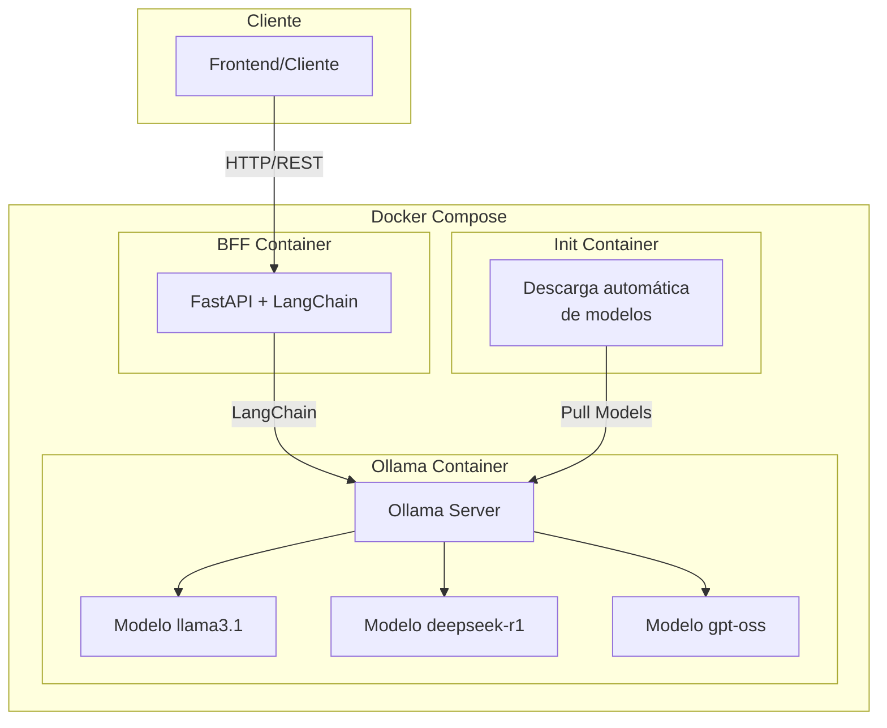

# 🤖 Ollama Model Suite

<div align="center">


Una suite completa para ejecutar y gestionar múltiples modelos de lenguaje usando Ollama con un BFF (Backend for Frontend) construido con FastAPI y LangChain.

[Características](#-características) •
[Instalación](#-instalación) •
[Uso](#-uso) •
[API](#-documentación-de-la-api) •
[Configuración](#-configuración)

</div>

---

## 🌟 Características

### 🚀 **Gestión Multi-Modelo**
- ✅ Soporte para múltiples modelos LLM simultáneamente
- 🔄 Descarga automática de modelos (pull)
- 📊 Lista dinámica de modelos disponibles
- 🔒 Control de acceso por modelo (whitelist opcional)

### 🔧 **API REST Completa**
- 💬 **Chat Completions** - Conversaciones con IA
- 🧮 **Embeddings** - Generación de vectores para texto
- 📥 **Model Management** - Descarga y gestión de modelos
- 🔍 **Health Checks** - Monitoreo del sistema

### 🛡️ **Características Avanzadas**
- 🌐 **CORS configurable** para desarrollo frontend
- ⚡ **Async/Await** para alto rendimiento
- 📝 **Validación con Pydantic** para datos seguros
- 🐳 **Containerización completa** con Docker
- 🔧 **Variables de entorno** para configuración flexible

---

## 🏗️ Arquitectura



---

## 📦 Instalación

### Prerrequisitos

- 🐳 [Docker](https://www.docker.com/get-started) y Docker Compose
- 📦 Git para clonar el repositorio

### Inicio Rápido

1. **Clona el repositorio**
   ```bash
   git clone https://github.com/tu-usuario/ollama-model-suite.git
   cd ollama-model-suite
   ```

2. **Inicia todos los servicios**
   ```bash
   docker-compose up -d
   ```

3. **Verifica que todo funcione**
   ```bash
   curl http://localhost:9900/health
   ```

4. **¡Listo!** 🎉
   - 🤖 **Ollama**: `http://localhost:11434`
   - 🔌 **API BFF**: `http://localhost:9900`
   - 📚 **Documentación**: `http://localhost:9900/docs`

---

## 🚀 Uso

### 💬 Chat con IA

```bash
curl -X POST "http://localhost:9900/chat" \
  -H "Content-Type: application/json" \
  -d '{
    "messages": [
      {"role": "user", "content": "¿Qué es la inteligencia artificial?"}
    ],
    "model": "llama3.1:latest",
    "temperature": 0.7
  }'
```

### 🧮 Generar Embeddings

```bash
curl -X POST "http://localhost:9900/embeddings" \
  -H "Content-Type: application/json" \
  -d '{
    "input": ["Hola mundo", "¿Cómo estás?"],
    "model": "llama3.1:latest"
  }'
```

### 📥 Descargar Nuevos Modelos

```bash
curl -X POST "http://localhost:9900/pull" \
  -H "Content-Type: application/json" \
  -d '{
    "name": "mistral:latest"
  }'
```

### 📊 Listar Modelos Disponibles

```bash
curl http://localhost:9900/models
```

---

## 📋 Documentación de la API

### 🔗 Endpoints Principales

| Método | Endpoint | Descripción |
|--------|----------|-------------|
| `GET` | `/health` | Estado del sistema |
| `GET` | `/models` | Lista de modelos disponibles |
| `POST` | `/chat` | Conversación con IA |
| `POST` | `/embeddings` | Generar vectores de texto |
| `POST` | `/pull` | Descargar modelo |
| `GET` | `/docs` | Documentación interactiva Swagger |

### 📖 Documentación Interactiva

Una vez que tengas el sistema ejecutándose, visita:
- 📚 **Swagger UI**: `http://localhost:9900/docs`
- 📄 **ReDoc**: `http://localhost:9900/redoc`

---

## ⚙️ Configuración

### 🌍 Variables de Entorno

| Variable | Por Defecto | Descripción |
|----------|-------------|-------------|
| `OLLAMA_BASE` | `http://ollama:11434` | URL base de Ollama |
| `DEFAULT_MODEL` | `llama3.1:latest` | Modelo por defecto |
| `ALLOWED_MODELS` | `gpt-oss:latest,deepseek-r1:latest,llama3.1:latest` | Modelos permitidos |
| `CORS_ORIGINS` | `*` | Orígenes CORS permitidos |
| `OLLAMA_MODELS` | `gpt-oss:latest,deepseek-r1:latest,llama3.1:latest` | Modelos a descargar automáticamente |

### 🔧 Personalización

#### Cambiar Modelos por Defecto

Edita el archivo `docker-compose.yml`:

```yaml
environment:
  - OLLAMA_MODELS=llama3.1:latest,mistral:latest,codellama:latest
  - DEFAULT_MODEL=mistral:latest
  - ALLOWED_MODELS=llama3.1:latest,mistral:latest,codellama:latest
```

#### Configurar CORS para Producción

```yaml
environment:
  - CORS_ORIGINS=https://miapp.com,https://www.miapp.com
```

---

## 🏗️ Estructura del Proyecto

```
ollama-model-suite/
├── 📄 docker-compose.yml      # Orquestación de servicios
├── 📁 bff/                    # Backend for Frontend
│   ├── 🐍 app.py             # Aplicación FastAPI principal
│   ├── 📋 requirements.txt    # Dependencias Python
│   ├── 🐳 Dockerfile         # Imagen del BFF
│   └── 📝 schemas.py         # Esquemas Pydantic
├── 📄 .gitignore             # Archivos ignorados por Git
└── 📖 README.md              # Este archivo
```

---

## 🛠️ Stack Tecnológico

### Backend
- 🐍 **Python 3.11+** - Lenguaje principal
- ⚡ **FastAPI** - Framework web moderno y rápido
- 🔗 **LangChain** - Framework para aplicaciones con LLM
- 📊 **Pydantic** - Validación de datos
- 🌐 **httpx** - Cliente HTTP asíncrono
- 🦄 **Uvicorn** - Servidor ASGI

### Infraestructura
- 🐳 **Docker & Docker Compose** - Containerización
- 🤖 **Ollama** - Motor de modelos LLM
- 🔄 **CORS** - Soporte para aplicaciones web

### Modelos Incluidos
- 🦙 **Llama 3.1** - Modelo conversacional avanzado
- 🧠 **DeepSeek R1** - Modelo de razonamiento
- 💻 **GPT-OSS** - Modelo de código abierto

---

## 🚦 Comandos Útiles

### 🔄 Gestión de Servicios

```bash
# Iniciar todos los servicios
docker-compose up -d

# Ver logs en tiempo real
docker-compose logs -f

# Parar todos los servicios
docker-compose down

# Reconstruir imágenes
docker-compose build --no-cache

# Reiniciar solo el BFF
docker-compose restart bff
```

### 🔍 Debugging

```bash
# Ver logs del BFF
docker-compose logs bff

# Ver logs de Ollama
docker-compose logs ollama

# Ejecutar comandos dentro del contenedor BFF
docker-compose exec bff bash

# Ver estado de los contenedores
docker-compose ps
```

---

## 🤝 Contribuir

¡Las contribuciones son bienvenidas! 🎉

1. 🍴 Fork el proyecto
2. 🌱 Crea una rama para tu feature (`git checkout -b feature/AmazingFeature`)
3. 💾 Commit tus cambios (`git commit -m 'Add some AmazingFeature'`)
4. 📤 Push a la rama (`git push origin feature/AmazingFeature`)
5. 🔃 Abre un Pull Request

---

## 📄 Licencia

Este proyecto está bajo la Licencia MIT. Ver el archivo `LICENSE` para más detalles.

---